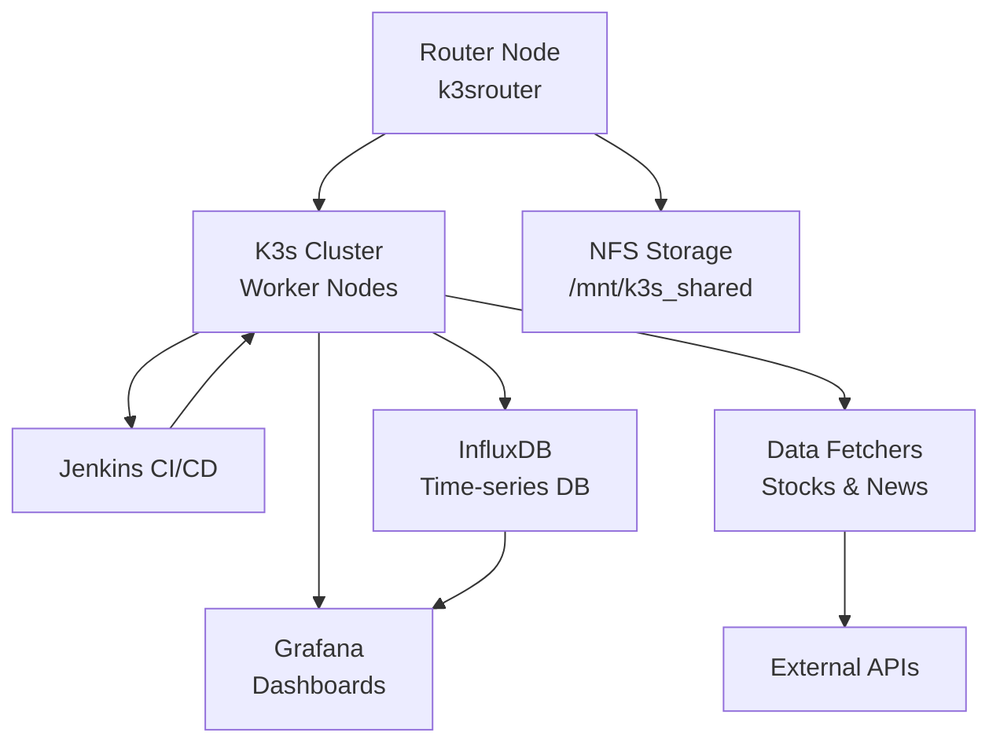

# StockOps Collections

[](https://opensource.org/licenses/MIT)
[](https://docs.ansible.com/ansible/latest/index.html)
[](https://www.raspberrypi.org/)

StockOps is a professional-grade, modular platform for collecting, processing, and visualizing stock market data, optimized for deployment on Raspberry Pi clusters. It combines enterprise-level tools with efficient resource utilization to create a powerful, self-hosted financial data operations environment.

---

## Table of Contents
- [Overview](#overview)
- [Prerequisites](#prerequisites)
- [System Architecture](#system-architecture)
- [Components](#components)
- [Installation Guide](#installation-guide)
  - [Hardware Setup](#hardware-setup)
  - [Network Configuration](#network-configuration)
  - [Initial Setup](#initial-setup)
  - [Deployment Steps](#deployment-steps)
- [Configuration](#configuration)
- [Accessing Services](#accessing-services)
- [Troubleshooting](#troubleshooting)
- [Contributing](#contributing)
- [License](#license)

---

## Overview

**stockops** is a fully automated DevOps and data-operations system that integrates:
- **Data ingestion** (Python fetchers for stocks and news),
- **Observability** (InfluxDB + Grafana dashboards),
- **Automation and CI/CD** (Jenkins and Ansible),
- **Orchestration** (K3s Kubernetes cluster),
- **Storage and persistence** (NFS-based shared storage).

All modules are deployed in a distributed Raspberry Pi environment.  
The project demonstrates how real-world automation and analytics can be implemented on low-power hardware using professional-grade tools.

## Prerequisites

### Hardware Requirements
- 1x Raspberry Pi 4B (8GB) for router node
- 2-3x Raspberry Pi 4B (4GB+) for worker nodes
- Network switch (Gigabit recommended)
- SD cards (32GB+ recommended)
- Power supplies
- Ethernet cables

### Software Requirements
- Raspberry Pi OS (64-bit, Lite) on all nodes
- Python 3.8+
- Ansible 2.9+
- Git
- SSH enabled on all nodes

### Network Setup
- Router node: 192.168.50.1
- Worker nodes: 192.168.50.101-103
- Subnet: 192.168.50.0/24

For detailed setup instructions, see our [Installation Guide](docs/installation.md).

---

## System Architecture

### Physical Architecture

```
                 ┌─────────────────────────┐
                 │ Raspberry Pi Cluster    │
                 │ (k3srouter, k3s1, ...)  │
                 └─────────────────────────┘
                             │
           ┌─────────────────┴─────────────────┐
           │                                   │
    ┌──────────────┐                    ┌──────────────┐
    │ Jenkins CI   │                    │ NFS Storage  │
    │ Builds, Push │                    │ /mnt/k3s_... │
    └──────────────┘                    └──────────────┘
           │                                   │
    ┌──────────────┐                    ┌──────────────┐
    │ Grafana      │◄──────InfluxDB────►│ Stocks Data  │
    │ Visualization│                    │ Metrics/Logs │
    └──────────────┘                    └──────────────┘
           │
    ┌──────────────┐
    │ Fetchers     │──►  API Feeds
    │ News/Stocks  │
    └──────────────┘
```

### Logical Architecture



## 📦 Components

| Component | Role | Description | Status |
|-----------|------|-------------|---------|
| Router | Infrastructure | Network management, DHCP, WiFi AP | ✅ |
| K3s | Orchestration | Lightweight Kubernetes cluster | ✅ |
| InfluxDB | Storage | Time-series data management | ✅ |
| Grafana | Visualization | Real-time dashboards and alerts | ✅ |
| Jenkins | Automation | CI/CD pipeline management | ✅ |
| News Fetcher | Data Collection | Financial news aggregation | ✅ |
| Stock Fetcher | Data Collection | Market data collection | ✅ |

---

## Collection Overview

This repository contains the **`stockops.core`** Ansible Collection — a modular automation suite designed to deploy and manage the StockOps DevOps environment on a Raspberry Pi–based K3s cluster.

### Key Components

| Layer | Role | Description |
|-------|------|--------------|
| Network | `router` | Configures Raspberry Pi router (Wi‑Fi AP, LAN/WAN, NAT, DHCP) |
| Kubernetes | `k3s` | Installs and joins nodes into a lightweight K3s cluster |
| Core Services | `influxdb`, `grafana`, `jenkins` | Deploys metrics storage, dashboards, and CI/CD pipelines |
| Applications | `apps_news`, `apps_stocks` | Deploys StockOps applications for news and stock ingestion |
| Utility | `cluster_checks`, `common` | Performs validation and shared setup tasks |

---

## Repository Structure

```
stockops-collections/
├── ansible_collections/
│   └── stockops/
│       └── core/
│           ├── roles/
│           ├── plugins/
│           ├── galaxy.yml
│           ├── README.md
│           └── ...
├── inventory.ini
├── play.yml
├── play_router.yml
├── play_k3s.yml
├── play_core.yml
├── play_apps.yml
├── .pre-commit-config.yaml
├── .ansible-lint
├── .yamllint.yaml
└── Makefile
```

---

## Quick Start

### Full Install

```bash
ansible-playbook -i inventory.ini play.yml -t full -e k3s_apply=true
```

### Stage-by-Stage

### Accessing Services

| Service  | URL                               | Default Credentials |
|----------|-----------------------------------|-------------------|
| Grafana  | http://192.168.50.101:30030      | admin/ChangeMe123! |
| InfluxDB | http://192.168.50.101:30886      | admin/ChangeMe123! |
| Jenkins  | http://192.168.50.101:30080      | admin/admin      |

For detailed configuration options, see our [Configuration Guide](docs/configuration.md).
For troubleshooting help, see our [Troubleshooting Guide](docs/troubleshooting.md).

```bash
ansible-playbook -i inventory.ini play.yml -t router
ansible-playbook -i inventory.ini play.yml -t k3s -e k3s_apply=true
ansible-playbook -i inventory.ini play.yml -t grafana
ansible-playbook -i inventory.ini play.yml -t influxdb,jenkins
ansible-playbook -i inventory.ini play.yml -t apps
```

---

## Development Hygiene

This repository enforces YAML and Ansible quality gates via **pre-commit hooks**.

### Pre-commit configuration

The `.pre-commit-config.yaml` file includes:
- **`ansible-lint`** — ensures best practices in roles/playbooks  
- **`yamllint`** — validates YAML syntax and structure  
- **`pre-commit-hooks`** — trims trailing spaces, checks end-of-file newlines, and ensures file hygiene

To enable locally:

```bash
pip install pre-commit
pre-commit install
pre-commit run --all-files
```

---

## Contributing

1. Fork and clone the repository  
2. Make changes to your role or playbook under `ansible_collections/stockops/core/`  
3. Test locally using `ansible-playbook -i inventory.ini play.yml -t your_tag`  
4. Submit a pull request

---

## License

This project is licensed under the **MIT License**.

---

## Author

**Meir A. (tomeir2105)**  
Built with dedication, patience, and curiosity — to make DevOps, automation, and data analytics accessible on low-cost hardware.
